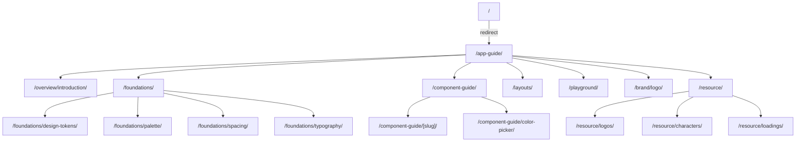

# 정보구조 (Information Architecture)

## 0. 시각 다이어그램



> 배포 환경에서는 `basePath:'/guide'`가 접두로 붙습니다. 예: `/guide/app-guide/…`

## 1. 메뉴/내비게이션 구조 (실제 라우트)
- `/` → redirect → `/app-guide`
- `/app-guide`
  - `/overview/introduction`
  - `/foundations`
    - `/design-tokens`
    - `/palette`
    - `/spacing`
    - `/typography`
  - `/component-guide`
    - `/[slug]` (MD에서 동적 생성)
    - `/color-picker` (예시 고정 페이지)
  - `/layouts`
  - `/playground`
  - `/brand/logo`
  - `/resource`
    - `/logos`, `/characters`, `/loadings`

### Tree
```
/
└─ /app-guide/
   ├─ /overview/
   │  └─ /introduction/
   ├─ /foundations/
   │  ├─ /design-tokens/
   │  ├─ /palette/
   │  ├─ /spacing/
   │  └─ /typography/
   ├─ /component-guide/
   │  ├─ /[slug]/
   │  └─ /color-picker/
   ├─ /layouts/
   ├─ /playground/
   ├─ /brand/
   │  └─ /logo/
   └─ /resource/
      ├─ /logos/
      ├─ /characters/
      └─ /loadings/
```

## 2. 컨텐츠 모델 (MDX/MD)
- 디렉토리: `content/component-guide`
- Front matter: `title`, `description`
- 슬러그: 파일명(`*.md`)

## 3. 사용자 플로우
- 사이드바 → 섹션 → 문서/컴포넌트 상세 → 코드/예제 확인

## 4. 검색/탐색성
- 사이드 네비/목차 중심, (선택) 검색 도입 여지

## 5. 접근성 고려사항
- 키보드 탐색, 포커스 표시, 명도 대비, ARIA 준수
